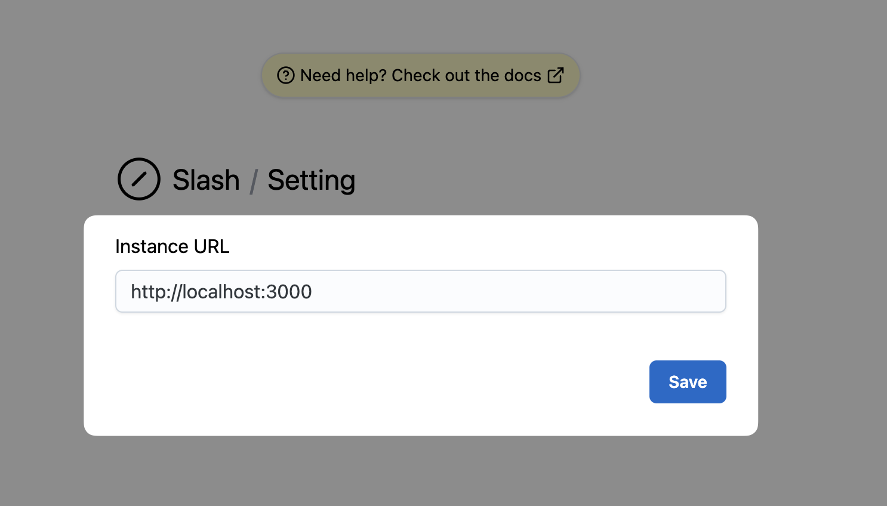

# The Browser Extension of Slash

Slash provides a browser extension to help you use your shortcuts in the search bar to go to the corresponding URL.

## How to use

### Install the extension

For Chromuim based browsers, you can install the extension from the [Chrome Web Store](https://chrome.google.com/webstore/detail/slash/ebaiehmkammnacjadffpicipfckgeobg).

For Firefox, you can install the extension from the [Firefox Add-ons](https://addons.mozilla.org/en-US/firefox/addon/your-slash/).

### Prerequisites

- You need to have a Slash instance running.
- Sign in with your account on the Slash instance.

### Configure the extension

The extension needs to know the instance url of your Slash. You can configure it by following the steps below:

1. Click on the extension icon and click on the "Settings" button.

   

2. Enter the instance url of your Slash and then "Save".

   

### Use your shortcuts in the search bar

You can use your shortcuts in the search bar of your browser. For example, if you have a shortcut named `gh` for [GitHub](https://github.com), you can type `s/gh` in the search bar and press `Enter` to go to [GitHub](https://github.com).

